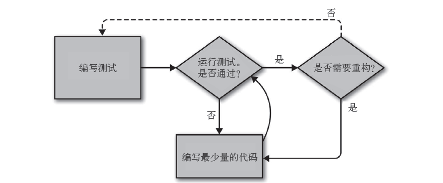
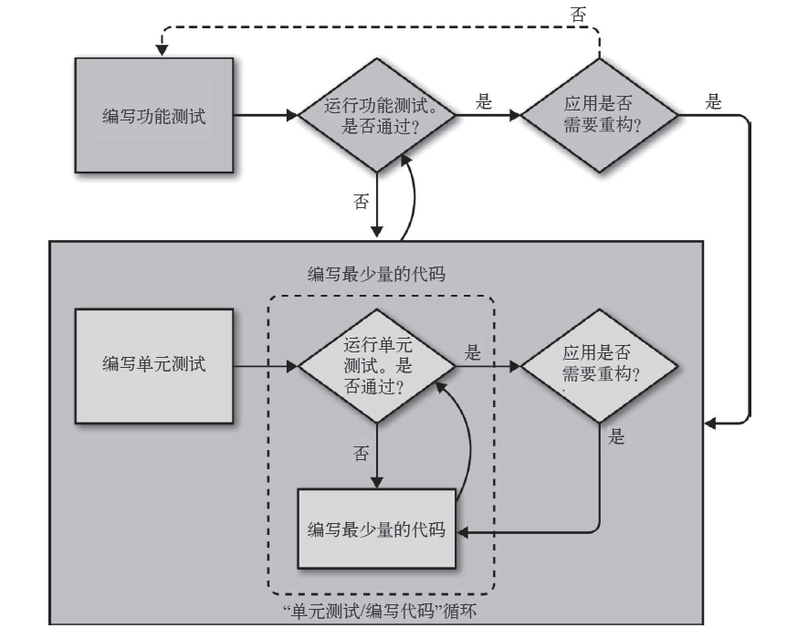

# 测试的意义

如果做完第三章的全流程，就只想骂人：

- 那么多，有必要吗？
- 最后几步明明可以合成一步的，那个home——page居然要等于None！
- 真实工作，就要这么写代码？
- ……

## 测试的意义

有些编程问题，需要精力与智慧。而工作的时间长了，至少精力会下降，

能省则省，把精力放在其他必要的地方，这就是测试的意义。

细化测试有什么意义呢？就跟你锻炼肌肉一样——明明可以不做那么多东西，明明每次都不用做到极致。但做到极致的效果是最好的，做到最后，你筋疲力竭时做的几个，锻炼效果是最棒的。（其实还是看不懂作者的理由，自己编了个来说服自己）

在你没有练好前，不要偷懒，否则后果自负。反正每个测试都很简单，那就做做嘛。

话不多说，继续实践

## 使用Selenium测试用户交互

上次做到哪了？好像是功能测试？先运行一下测试：

```shell
$ python functional_tests.py
## 载入页面时出错
```

噢！忘了开django服务器。。`python manage.py runserver`

```
$ python functional_tests.py
F
======================================================================
FAIL: test_can_start_a_list_and_retrieve_it_later (__main__.NewVistorTest)
----------------------------------------------------------------------
Traceback (most recent call last):
  File "functional_tests.py", line 18, in test_can_start_a_list_and_retrieve_it_later
    self.fail('Finish the test!')
AssertionError: Finish the test!

----------------------------------------------------------------------
Ran 1 test in 7.590s

FAILED (failures=1)
```

> 这也反映了TDD的一个优点——不会忘记接下来要做啥，重新运行测试就知道了。

### *functional_tests.py*

结束这个测试吧！

```python
from selenium import webdriver
from selenium.webdriver.common.keys import Keys
import time
import unittest

class NewVistorTest(unittest.TestCase):
    def setUp(self):
        self.browser = webdriver.Firefox()
        
    def tearDown(self):
        self.browser.quit()
        
    def test_can_start_a_list_and_retrieve_it_later(self):
        # 朋友推荐了一款在线待办事项清单，
        # 叶秋去看了
        self.browser.get('http://localhost:8000')
        
        # 她注意到，网页的标题和头部都包含“To-Do”这个词
        self.assertIn('To-Do', self.browser.title)
        header_text = self.browser.find_element_by_tag_name('h1').text  # 1111
        self.assertIn('To-Do', header_text)
        
        # 应用请她输入一个待办事项
        inputbox = self.browser.find_element_by_id('id_new_item')  # 1111
        self.assertEqual(
            inputbox.get_attribute('placeholder'),
            'Enter a to-do item'
        )
        
        # 她在一个文本框中输入了“买孔雀羽”
        # 她的爱好是用假蝇做饵钓鱼
        inputbox.send_keys('Buy peacock feathers')  # 2222
        
        # 她按回车键后，页面更新
        # 待办事项表格显示了“1.买孔雀羽”
        inputbox.send_keys(Keys.ENTER)  # 3333
        time.sleep(1)  # 4444
        
        table = self.browser.find_element_by_id('id_list_table')
        rows = table.find_elements_by_tag_name('tr') ## 1111
        self.assertTrue(
            any(row.text == '1: Buy peacock feathers' for row in rows)
        )
        
        # 然后页面又显示了一个文本框，可以输入其他的待办事项
        # 她输入了“用孔雀羽做假蝇”
        # 叶秋做事很有条理
        self.fail('Finish the test!')

        # 页面再次更新，她的清单也显示了这两个待办事项
        pass
        # 叶秋想知道这个网站是否会保存她的清单
        # 她看到网站为她生成了一个唯一的URL
        # 而且页面中有文字展示了这个功能

        # 她访问那个URL，发现她的待办事项列表还在

        # 她很满意，就去玩了
if __name__ == '__main__':
    unittest.main(warnings='ignore')
```

### 注释

1. Selenium提供的用了查找网页的方法，这里用三个：`find_element_by_tag_name`、`find_element_by_id`、`find_elements_by_tag_name`。注意第三个element带s，也就是它会返回含有多个元素的列表，或者空列表。不带s的返回一个元素或报错；

2. send_keys：Selenium在输入框中输入内容的方法；

3. Keys（需要导入）：发送回车键等特殊的按键；

4. 按下回车键后页面会刷新。time.sleep的作用是等待页面加载完毕。这就叫“显示等待”；

5. 搜索

   1. any函数，
   2. Guido 名为“From List Comprehensions to Generator Expressions”的文
      章，[或许这篇也可以](https://www.pythonlikeyoumeanit.com/Module2_EssentialsOfPython/Generators_and_Comprehensions.html)

   > Why the differences, and why the changes to a more restrictive list comprehension in Python 3? The factors affecting the design were backwards compatibility, avoiding ambiguity, the desire for equivalence, and evolution of the language. Originally, Python (before it even had a version :-) only had the explicit for-loop. There is no ambiguity here for the part that comes after 'in': it is always followed by a colon. Therefore, I figured that if you wanted to loop over a bunch of known values, you shouldn't be bothered with having to put parentheses around them.[link](http://python-history.blogspot.com/2010/06/from-list-comprehensions-to-generator.html)


### 继续测试

```shell
$ python functional_tests.py
...
header_text = self.browser.find_element_by_tag_name('h1').text  # 1111
...
selenium.common.exceptions.NoSuchElementException: Message: Unable to locate element: h1
```

没有h1标签，那好，加上呗。


## 使用模板，不测常量
慢着，每次都要测试html，是不有点烦呢？——之前说不要测试常量，这种html元素不就跟常量一样么？

对的，单元测试要测试的是逻辑、流程控制和配置。断言监测HTML不是单元测试要做的。

还有，python代码中不应该直接插有HTML，用模板吧——用.html文件的好处太多了。

### 使用模板重构

重构原则：重构时，不能没有测试。。。哦，，之前有了：

```shell
$ python manage.py test
```
重构后通过才行。


#### lists/templates/home.html
```html
<html>
  <title>To-Do list</title>
</html>
```
最起码也有高亮啊！
#### lists/views.py
```python
from django.shortcuts import render

def home_page(request):
    return render(request, 'home.html')
```

把HttpResponse换成render，第一个参数为request，第二个为渲染的模板名称——Django会搜索相应的templates文件夹，然后根据模板内容构建一个HttpResponse对象。

> 模板不仅有打开html文件的功能，它强大的地方还未体现——它能把python变量、条件控制导入。

```shell
$ python manage.py test
Creating test database for alias 'default'...
System check identified no issues (0 silenced).
E.
======================================================================
ERROR: test_home_page_returns_correct_html (lists.tests.HomePageTest)  ## 2222
----------------------------------------------------------------------
Traceback (most recent call last):
  File "E:\application\websites\django\TestCaprineDjango\P1TDD_DjangoBase\C4testMean\superlists\lists\tests.py", line 15, in test_home_page_returns_correct_html
    response = home_page(request)  ## 3333
  File "E:\application\websites\django\TestCaprineDjango\P1TDD_DjangoBase\C4testMean\superlists\lists\views.py", line 4, in home_page
    return render(request, 'home.html')  ## 4444
  File "D:\PyVirtualenv\django2.0\lib\site-packages\django\shortcuts.py", line 36, in render
    content = loader.render_to_string(template_name, context, request, using=using)
  File "D:\PyVirtualenv\django2.0\lib\site-packages\django\template\loader.py", line 61, in render_to_string
    template = get_template(template_name, using=using)
  File "D:\PyVirtualenv\django2.0\lib\site-packages\django\template\loader.py", line 19, in get_template
    raise TemplateDoesNotExist(template_name, chain=chain)
django.template.exceptions.TemplateDoesNotExist: home.html ## 1111

----------------------------------------------------------------------
Ran 2 tests in 0.006s

FAILED (errors=1)
```

#### 看看错哪了？

1. 错误是什么：找不到模板；
2. 失败的测试：刚添加的测试HTML的；
3. 导致失败的：调用home_page那一行；
4. 在应用代码找到导致失败的部分：调用render函数的。

Django怎么就找不到模板了呢？不是放在templates文件了吗？

原因是，Django不知道你创建了一个应用，你要在设置中告诉它：

#### *superlists/settings.py*

```python
# Application definition

INSTALLED_APPS = [
    'django.contrib.admin',
    'django.contrib.auth',
    'django.contrib.contenttypes',
    'django.contrib.sessions',
    'django.contrib.messages',
    'django.contrib.staticfiles',
    'lists',
]
```

再测一次，应该能行吧？

```shell
$ python manage.py test
...
OK
```

### Django测试客户端

#### *lists/tests.py*

```python
[...]
from django.template.loader import render_to_string
[...]
    def test_home_page_returns_correct_html(self):
        request = HttpRequest()
        response = home_page(request)
        html = response.content.decode('utf8')
        expected_html = render_to_string('home.html')
        self.assertEqual(html, expected_html)
```

> 这样的测试有点笨了，Django提供了测试客户端才是检查使用哪个模板的原生方式。

```python
    def test_home_page_returns_correct_html(self):
        response = self.client.get('/')

        html = response.content.decode('utf8')
        self.assertTrue(html.startswith('<html>'))
        self.assertIn('<title>To-Do lists</title>', html)
        self.assertTrue(html.strip().endswith('</html>'))

        self.assertTemplateUsed(response, 'home.html')
```

不是说不测是常量吗？怎么还有那三行啊？只保留最后一行，测试通过测试客户端获取的响应就好了吧？这是因为“小步走”的原则优先，免得改太多出错难找。

总之，现在应该能通过测试，但总有些不放心，不放心就想把测试改错：

```python
        self.assertTemplateUsed(response, 'wrong.html')
```

```shell
AssertionError: False is not true : Template 'wrong.html' was not a template used to render the response. Actual template(s) used: home.html
```

错误信息告诉你，现在用的是home.html，而不是wrong.html。so~

#### *lists/tests.py*

```python
from django.test import TestCase

class HomePageTest(TestCase):
    def test_home_page_returns_correct_html(self):
        response = self.client.get('/')
        self.assertTemplateUsed(response, 'home.html')
```

> “不测常量，要测实现方法”。
>
> 好的。

## 重构之难

偶尔，你会忍不住，跳过几步，重构时还想修改应用的功能。不久，改动的文件越来越多，最终忘记自己身在何处，而且，一切异常。。。如下图：


> 重构和功能调整要完全分开

### git

```shell
git st
git add .
git diff --staged
git ci -m "Refactor home page view to use a template"
```

## 接着修改

功能测试还是不过的，要让它通过。首先，我们要`<h1>`

### *lists/templates/home.html*

```html
<html>
    <head>
        <title>To-Do lists</title>
    </head>
    <body>
        <h1>Your To-Do lists</h1>
    </body>
</html>
```

测试，希望这次记得运行django

```shell
NoSuchElementException: Message: Unable to locate element: [id="id_new_item"]
```

再加呗

```html
[...]
        <h1>Your To-Do lists</h1>
        <input id="id_new_item" />
[...]
```

```
AssertionError: '' != 'Enter a to-do item'
+ Enter a to-do item
```

加占位文字

```html
<input id="id_new_item" placeholder="Enter a to-do item" />
```

- placeholder 属性提供可描述输入字段预期值的提示信息（hint）

```
NoSuchElementException: Message: Unable to locate element: [id="id_list_table"]
```

加表格

```html
<input id="id_new_item" placeholder="Enter a to-do item" />
<table id="id_list_table">
</table>
```

```
Traceback (most recent call last):
  File "functional_tests.py", line 42, in test_can_start_a_list_and_retrieve_it_later
    any(row.text == '1: Buy peacock feathers' for row in rows)
AssertionError: False is not true
```

### *functional_tests.py*

上面不太好懂，看看定位，any函数那里，那就先编写错误消息：

```python
        self.assertTrue(
            any(row.text == '1: Buy peacock feathers' for row in rows),
            "New to-do item did not appear in table"
        )
```

```
        self.assertTrue(
            any(row.text == '1: Buy peacock feathers' for row in rows),
            "New to-do item did not appear in table"
        )
```

想要row的话要提交表单呢。。。那是下一章的事情了。今天也累了，进入git和总结环节吧

## git总结

- 功能测试
- 单元测试
- 测试循环
- 重构

图以后要自己画，自己诠释才行

作者代码https://github.com/hjwp/book-example/

> 

> 


