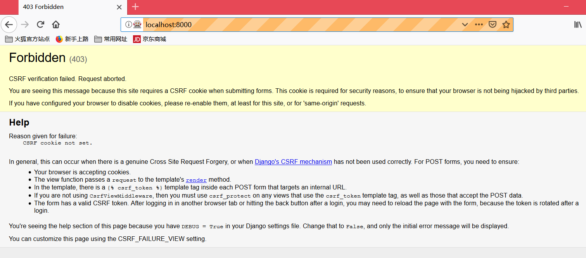

# 保存用户输入：测试数据库

保存待办事项前，要获取用户输入的待办事项，发送给服务器。保存后，才能发回给用户查看。

> 作者：写这章的时候，他立刻加了几个模型、创建了一组不同的URL、写了三个视图函数、又编写六七个单元测试……还好还是改回来了，虽然他觉得自己很聪明，能一次解决这些。
>
> 不仅是因为TDD的理念，还因为这很适合你的学习曲线——一次只介绍一个新概念，而不是一次好几个，砸得你头疼。

现在做得事情好像很“傻瓜”，别人让做什么就做什么，后面会要求你“聪明一些”，现在，还是“傻瓜”下去吧。

## 编写表单，POST请求

现在的事情有些无聊，为了后面酷炫的H5、JS用法打打基础呗。

为了让浏览器发送POST请求，要做两件事：

1. 给`<input>`元素指定name=属性；
2. 把它放在`<form>`标签中，并为`<form>`标签指定method="POST"属性。

### *lists/templates/home.html*

```python
<h1>Your To-Do lists</h1>
<form method="POST">
    <input id="id_new_item" placeholder="Enter a to-do item" />
</form>
<table id="id_list_table">
</table>
```

运行功能测试，出现了一个晦涩的错误：

```shell
$ python functional_tests.py
[...]
 File "functional_tests.py", line 39, in test_can_start_a_list_and_retrieve_it_later
    table = self.browser.find_element_by_id('id_list_table')
[...]
selenium.common.exceptions.NoSuchElementException: Message: Unable to locate element: [id="id_list_table"]
```

> 如果功能测试意外失败，可以做四种处理（找出问题即可）：
>
> 1. print出输出页面中，当前显示的文本
> 2. 改进错误消息，显示当前状态的更多信息
> 3. 自己手动访问网站
> 4. 在测试执行过程中使用time.sleep暂停（常用）

下面试试常用的time.sleep——错误发生前就已经休眠了，那就延长休眠时间：

### *functional_tests.py*

```python
# 按回车键后，页面更新了
# 待办事项表格中显示了“1: Buy peacock feathers”
inputbox.send_keys(Keys.ENTER)
time.sleep(10)
table = self.browser.find_element_by_id('id_list_table')
```

再次运行，你发现你有机会看到浏览器的页面了（10秒）



此时会有[跨站请求伪造](http://www.cnblogs.com/hyddd/archive/2009/04/09/1432744.html)（Cross-Site Request Forgery, CSRF）相关的错误，Django为了防范这个安全漏洞，在生成的每个表单中放置一个自动生成的令牌，通过这个令牌判断POST请求是否来自同一个网站。

我们要通过这个验证，就需要使用模板标签添加CSRF令牌。

### *lists/templates/home.html*

```HTML
<form method="POST">
    <input name="item_text" id="id_new_item" placeholder="Enter a to-do item" />
    
</form>
```

再次测试，（或许需要Ctrl+C中断测试）错误，但是是预期的错误：

```shell
AssertionError: False is not true : New to-do item did not appear in table
```

把time.sleep(10)改回1吧。

## 在服务器中处理POST请求

### *list/tests.py*


```python
    def test_home_page_returns_correct_html(self):
        response = self.client.get('/')
        self.assertTemplateUsed(response, 'home.html')

    def test_can_save_a_POST_request(self):
        response = self.client.post('/', data={'item_text': 'A new list item'})
        self.assertIn('A new list item', response.content.decode())

```

self.client.post：发送POST请求，
data参数，指定想发送的表单数据。
assertIn检查POST请求渲染得到的HTML中是否有指定的文本。

运行测试后，会看到预期的失败:

```shell
$ python manage.py test
[...]
AssertionError: 'A new list item' not found in '<html>\n    <head>\n        <title>To-Do lists</title>\n    </head>\n    <body>\n        <h1>Your To-Do lists</h1>\n        <form method="POST">\n            <input id="id_new_item" 
[...]
```

为了让测试通过，可以加个if，当然，返回值是十分蠢的：

### lists/views.py

```python
from django.http import HttpResponse
from django.shortcuts import render

def home_page(request):
    if request.method == 'POST':
        return HttpResponse(request.POST['item_text'])
    return render(request, 'home.html')
```

过了测试，但不是真正想要的——要的是把POST请求提交的数据添加到首页模板的表格里。

## 把Python变量传入模板中渲染

要感受模板的强大威力了：

### *lists/templates/home.html*

```html
        <form method="POST">
            <input id="id_new_item" placeholder="Enter a to-do item" />
            
        </form>
        <table id="id_list_table">
            <tr><td>{{ new_item_text }}</td></tr>
        </table>
```

### *lists/tests.py*

方法`test_can_save_a_POST_request`后面补一个断言，以阻止上面愚蠢的解法。

```python
self.assertTemplateUsed(response, 'home.html')
```

测试：`AssertionError: No templates used to render the response`

老老实实改视图呗，把POST请求的参数传入模板。

> 这里卡了一会，发现，其实就是测试发送了POST请求，要返回包含POST请求的网页而已

### *views.py*

```python
def home_page(request):
    return render(request, 'home.html', {
        'new_item_text': request.POST['item_text'],
    })
```

运行单元测试：

```
ERROR: test_home_page_returns_correct_html (lists.tests.HomePageTest)
[...]
tests.py", line 5, in test_home_page_returns_correct_html
    response = self.client.get('/')
[...]
File "\...\superlists\lists\views.py", line 6, in home_page
[...]
django.utils.datastructures.MultiValueDictKeyError: 'item_text'
```

*意料之外的失败*

阅读一下追踪吧，是另一个测试出错了`test_home_page_returns_correct_html`。我们这次调整，通过了新的测试，却破坏了旧的功能——没有POST请求时的那个（“回归”）

这就测试的意义。你想，如果不是测试，你改的是应用的代码，而且还要自己在浏览器里点来点去（好吧，第一次做网站的时候，我就是这样的。。）

而TDD，能在测试里直接发现问题所在，直接修正代码：

### *lists/views.py*

```python
def home_page(request):
    return render(request, 'home.html', {
        'new_item_text': request.POST.get('item_text', ''),
    })
```

不太理解改动，查了下[dict.get](https://docs.python.org/3/library/stdtypes.html?highlight=dict%20get#dict.get)，就是字典的get方法，如果'item_text'这个`key`存在，就返回它的值；否则返回`''`,即空字符串。

可能有点不好，就是一直错会让自己不舒服，但起码，这个单元测试通过了。

然后又该到功能测试报错了（记得开服务器）：

```
AssertionError: False is not true : New to-do item did not appear in table
```

大概知道在哪里错，但不自己操作浏览器的话看不出来怎么办。

但，还能“改进错误消息”，另一种功能测试的调试技术。

### *functional_tests.py

```python
self.assertTrue(
    any(row.text == '1: Buy peacock feathers' for row in rows),
    f"New to-do item did not appear in table. Contents were:\n{table.text}"
)
```

f"{局部变量名}"，Python3.6新增的字符串句法。

```
 Contents were:


```

怎么是空的呢？哦，忘了在input里加`name="item_text"`

### *lists/templates/home.html*

```html
        <form method="POST">
            <input name="item_text" id="id_new_item" placeholder="Enter a to-do item" />
            
        </form>
        <table id="id_list_table">
            <tr><td>{{ new_item_text }}</td></tr>
        </table>
```

```shell
AssertionError: False is not true : New to-do item did not appear in table. Contents were:
Buy peacock feathers
```

放弃any，把六行改成一行：
### *functional_tests.py

```python
        table = self.browser.find_element_by_id('id_list_table')
        rows = table.find_elements_by_tag_name('tr')
        self.assertIn('1: Buy peacock feathers', [row.text for row in rows])
        # self.assertTrue(
        #     any(row.text == '1: Buy peacock feathers' for row in rows),
        #     f"New to-do item did not appear in table. Contents were:\n{table.text}"
        # )
```

用any很酷炫，但把问题过度复杂化了，对的，就是秀聪明的时候，会这样。（测试的意义？少秀聪明）

再测试

```
AssertionError: '1: Buy peacock feathers' not found in ['Buy peacock feathers']
```

你可能想到了，就是少个'1：'嘛，在模板中加不就好了？可以的。

加上后，可以听一下三角法：

### “红灯/绿灯/重构”和三角法

> “单元测试/编写代码”循环可以用“红灯/绿灯/重构”表示：
> 
> 1. 红灯：写一个会失败的单元测试；
> 2. 绿灯：想办法通过，就算作弊也行；
> 3. 重构：改进代码，让其更合理
>
> 红绿灯阶段已经经历了很多次了，重构阶段又要做什么呢？
>
> 1. 消除重复：前面作弊用的常量，比如“1:”，在 测试里有、应用也有，就叫重复。就应该重构——也就是你不能作弊了。
> 2. 三角法（作者推荐）：再写一个测试，强制自己编写更好的代码。

现在，用三角法，检查第二个列表项目是否有"2:"

```
AssertionError: '1: Buy peacock feathers' not found in ['1: Use peacock feathers to make a fly']
```

错误很明显

## 三则重构

先看看代码，想想它为什么要重构，这有助于你培养相关“嗅觉”（找出丑陋代码的味道？）。

刚刚的测试用了三个几乎一样的代码块，违反了“Don't Repeat Yourself, DRY”的原则，按“三则重构”的方法论，该删除重复了。

但是，重构时一定要先git：

```
git diff

git ci -a
```