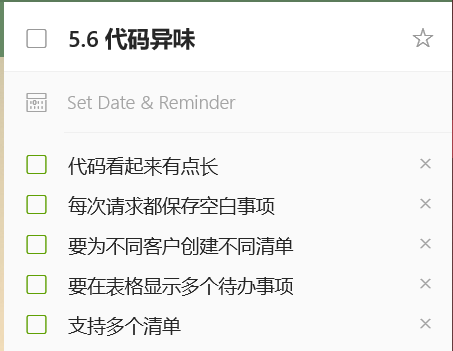
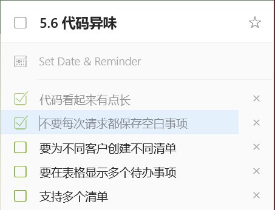
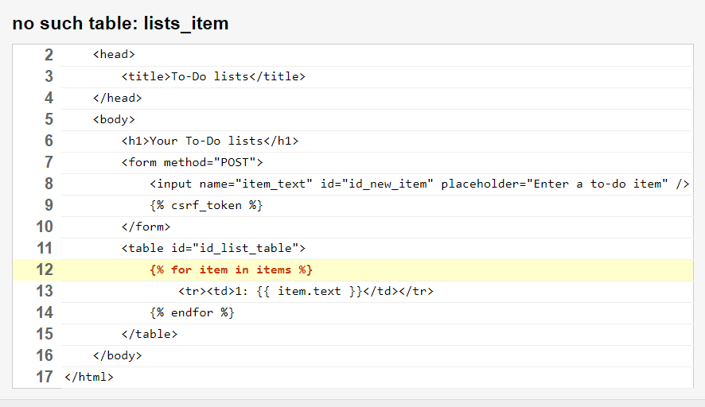
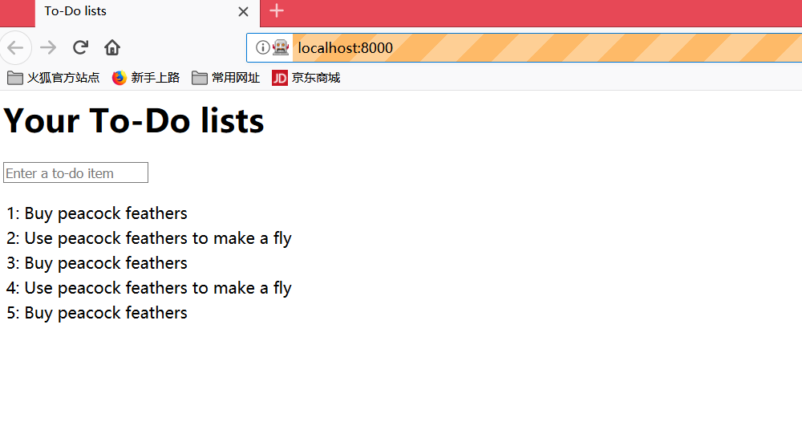
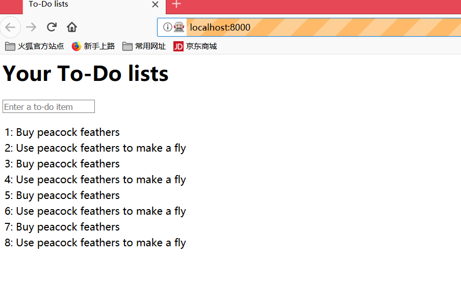
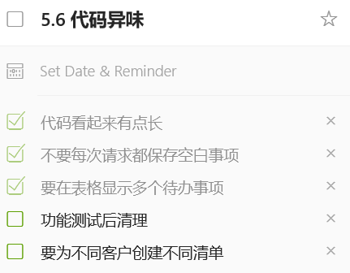

# 保存用户输入：测试数据库

保存待办事项前，要获取用户输入的待办事项，发送给服务器。保存后，才能发回给用户查看。

> 作者：写这章的时候，他立刻加了几个模型、创建了一组不同的URL、写了三个视图函数、又编写六七个单元测试……还好还是改回来了，虽然他觉得自己很聪明，能一次解决这些。
>
> 不仅是因为TDD的理念，还因为这很适合你的学习曲线——一次只介绍一个新概念，而不是一次好几个，砸得你头疼。

现在做得事情好像很“傻瓜”，别人让做什么就做什么，后面会要求你“聪明一些”，现在，还是“傻瓜”下去吧。

## 编写表单，POST请求

现在的事情有些无聊，为了后面酷炫的H5、JS用法打打基础呗。

为了让浏览器发送POST请求，要做两件事：

1. 给`<input>`元素指定name=属性；
2. 把它放在`<form>`标签中，并为`<form>`标签指定method="POST"属性。

### *lists/templates/home.html*

```python
<h1>Your To-Do lists</h1>
<form method="POST">
    <input id="id_new_item" placeholder="Enter a to-do item" />
</form>
<table id="id_list_table">
</table>
```

运行功能测试，出现了一个晦涩的错误：

```shell
$ python functional_tests.py
[...]
 File "functional_tests.py", line 39, in test_can_start_a_list_and_retrieve_it_later
    table = self.browser.find_element_by_id('id_list_table')
[...]
selenium.common.exceptions.NoSuchElementException: Message: Unable to locate element: [id="id_list_table"]
```

> 如果功能测试意外失败，可以做四种处理（找出问题即可）：
>
> 1. print出输出页面中，当前显示的文本
> 2. 改进错误消息，显示当前状态的更多信息
> 3. 自己手动访问网站
> 4. 在测试执行过程中使用time.sleep暂停（常用）

（也叫功能测试调试技术）

下面试试常用的time.sleep——错误发生前就已经休眠了，那就延长休眠时间：

### *functional_tests.py*

```python
# 按回车键后，页面更新了
# 待办事项表格中显示了“1: Buy peacock feathers”
inputbox.send_keys(Keys.ENTER)
time.sleep(10)
table = self.browser.find_element_by_id('id_list_table')
```

再次运行，你发现你有机会看到浏览器的页面了（10秒）


此时会有[跨站请求伪造](http://www.cnblogs.com/hyddd/archive/2009/04/09/1432744.html)（Cross-Site Request Forgery, CSRF）相关的错误，Django为了防范这个安全漏洞，在生成的每个表单中放置一个自动生成的令牌，通过这个令牌判断POST请求是否来自同一个网站。

我们要通过这个验证，就需要使用模板标签添加CSRF令牌。

### *lists/templates/home.html*

```HTML
<form method="POST">
    <input name="item_text" id="id_new_item" placeholder="Enter a to-do item" />
    
</form>
```

再次测试，（或许需要Ctrl+C中断测试）错误，但是是预期的错误：

```shell
AssertionError: False is not true : New to-do item did not appear in table
```

把time.sleep(10)改回1吧。

## 在服务器中处理POST请求

### *list/tests.py*


```python
    def test_home_page_returns_correct_html(self):
        response = self.client.get('/')
        self.assertTemplateUsed(response, 'home.html')

    def test_can_save_a_POST_request(self):
        response = self.client.post('/', data={'item_text': 'A new list item'})
        self.assertIn('A new list item', response.content.decode())

```

self.client.post：发送POST请求，
data参数，指定想发送的表单数据。
assertIn检查POST请求渲染得到的HTML中是否有指定的文本。

运行测试后，会看到预期的失败:

```shell
$ python manage.py test
[...]
AssertionError: 'A new list item' not found in '<html>\n    <head>\n        <title>To-Do lists</title>\n    </head>\n    <body>\n        <h1>Your To-Do lists</h1>\n        <form method="POST">\n            <input id="id_new_item" 
[...]
```

为了让测试通过，可以加个if，当然，返回值是十分蠢的：

### lists/views.py

```python
from django.http import HttpResponse
from django.shortcuts import render

def home_page(request):
    if request.method == 'POST':
        return HttpResponse(request.POST['item_text'])
    return render(request, 'home.html')
```

过了测试，但不是真正想要的——要的是把POST请求提交的数据添加到首页模板的表格里。

## 把Python变量传入模板中渲染

要感受模板的强大威力了：

### *lists/templates/home.html*

```html
        <form method="POST">
            <input id="id_new_item" placeholder="Enter a to-do item" />
            
        </form>
        <table id="id_list_table">
            <tr><td>{{ new_item_text }}</td></tr>
        </table>
```

### *lists/tests.py*

方法`test_can_save_a_POST_request`后面补一个断言，以阻止上面愚蠢的解法。

```python
self.assertTemplateUsed(response, 'home.html')
```

测试：`AssertionError: No templates used to render the response`

老老实实改视图呗，把POST请求的参数传入模板。

> 这里卡了一会，发现，其实就是测试发送了POST请求，要返回包含POST请求的网页而已

### *views.py*

```python
def home_page(request):
    return render(request, 'home.html', {
        'new_item_text': request.POST['item_text'],
    })
```

运行单元测试：

```
ERROR: test_home_page_returns_correct_html (lists.tests.HomePageTest)
[...]
tests.py", line 5, in test_home_page_returns_correct_html
    response = self.client.get('/')
[...]
File "\...\superlists\lists\views.py", line 6, in home_page
[...]
django.utils.datastructures.MultiValueDictKeyError: 'item_text'
```

*意料之外的失败*

阅读一下追踪吧，是另一个测试出错了`test_home_page_returns_correct_html`。我们这次调整，通过了新的测试，却破坏了旧的功能——没有POST请求时的那个（“回归”）

这就测试的意义。你想，如果不是测试，你改的是应用的代码，而且还要自己在浏览器里点来点去（好吧，第一次做网站的时候，我就是这样的。。）

而TDD，能在测试里直接发现问题所在，直接修正代码：

### *lists/views.py*

```python
def home_page(request):
    return render(request, 'home.html', {
        'new_item_text': request.POST.get('item_text', ''),
    })
```

不太理解改动，查了下[dict.get](https://docs.python.org/3/library/stdtypes.html?highlight=dict%20get#dict.get)，就是字典的get方法，如果'item_text'这个`key`存在，就返回它的值；否则返回`''`,即空字符串。

可能有点不好，就是一直错会让自己不舒服，但起码，这个单元测试通过了。

然后又该到功能测试报错了（记得开服务器）：

```
AssertionError: False is not true : New to-do item did not appear in table
```

大概知道在哪里错，但不自己操作浏览器的话看不出来怎么办。

但，还能“改进错误消息”，另一种功能测试调试技术。

### *functional_tests.py

```python
self.assertTrue(
    any(row.text == '1: Buy peacock feathers' for row in rows),
    f"New to-do item did not appear in table. Contents were:\n{table.text}"
)
```

f"{局部变量名}"，Python3.6新增的字符串句法。

```
 Contents were:


```

怎么是空的呢？哦，忘了在input里加`name="item_text"`

### *lists/templates/home.html*

```html
        <form method="POST">
            <input name="item_text" id="id_new_item" placeholder="Enter a to-do item" />
            
        </form>
        <table id="id_list_table">
            <tr><td>{{ new_item_text }}</td></tr>
        </table>
```

```shell
AssertionError: False is not true : New to-do item did not appear in table. Contents were:
Buy peacock feathers
```

放弃any，把六行改成一行：
### *functional_tests.py

```python
        table = self.browser.find_element_by_id('id_list_table')
        rows = table.find_elements_by_tag_name('tr')
        self.assertIn('1: Buy peacock feathers', [row.text for row in rows])
        # self.assertTrue(
        #     any(row.text == '1: Buy peacock feathers' for row in rows),
        #     f"New to-do item did not appear in table. Contents were:\n{table.text}"
        # )
```

用any很酷炫，但把问题过度复杂化了，对的，就是秀聪明的时候，会这样。（测试的意义？少秀聪明）

再测试

```
AssertionError: '1: Buy peacock feathers' not found in ['Buy peacock feathers']
```

你可能想到了，就是少个'1：'嘛，在模板中加不就好了？可以的。

加上后，可以听一下三角法：

### “红灯/绿灯/重构”和三角法

> “单元测试/编写代码”循环可以用“红灯/绿灯/重构”表示：
> 
> 1. 红灯：写一个会失败的单元测试；
> 2. 绿灯：想办法通过，就算作弊也行；
> 3. 重构：改进代码，让其更合理
>
> 红绿灯阶段已经经历了很多次了，重构阶段又要做什么呢？
>
> 1. 消除重复：前面作弊用的常量，比如“1:”，在 测试里有、应用也有，就叫重复。就应该重构——也就是你不能作弊了。
> 2. 三角法（作者推荐）：再写一个测试，强制自己编写更好的代码。

现在，用三角法，检查第二个列表项目是否有"2:"

```
AssertionError: '1: Buy peacock feathers' not found in ['1: Use peacock feathers to make a fly']
```

错误很明显

## 三则重构

先看看代码，想想它为什么要重构，这有助于你培养相关“嗅觉”（找出丑陋代码的味道？）。

刚刚的测试用了三个几乎一样的代码块，违反了“Don't Repeat Yourself, DRY”的原则，按“三则重构”的方法论，该删除重复了。

但是，重构时一定要先git：

```
git diff

git ci -a
```

重构，就先添加一个辅助函数

### *functional_tests.py*

```python
    def check_for_row_in_list_table(self, row_text):
        table = self.browser.find_element_by_id('id_list_table')
        rows = table.find_elements_by_tag_name('tr')
        self.assertIn(row_text, [row.text for row in rows])

    def test_can_start_a_list_and_retrieve_it_later(self):
        [...]
        # 她按回车键后，页面更新
        # 待办事项表格显示了“1.买孔雀羽”
        inputbox.send_keys(Keys.ENTER)
        time.sleep(1)
        self.check_for_row_in_list_table('1: Buy peacock feathers')
        
        # 然后页面又显示了一个文本框，可以输入其他的待办事项
        # 她输入了'Use peacock feathers to make a fly'(“用孔雀羽做假蝇”)
        # 叶秋做事很有条理
        inputbox = self.browser.find_element_by_id('id_new_item')
        inputbox.send_keys('Use peacock feathers to make a fly')
        inputbox.send_keys(Keys.ENTER)
        time.sleep(1)

        # 页面再次更新，她的清单也显示了这两个待办事项
        self.check_for_row_in_list_table('1: Buy peacock feathers')
        self.check_for_row_in_list_table('2: Use peacock feathers to make a fly')
        
        # 叶秋想知道这个网站是否会保存她的清单
```

记得吗？重构前后要保持一致：

```shell
AssertionError: '1: Buy peacock feathers' not found in ['1: Use peacock feathers to make a fly']
```

很好，可以git了

```shell
git diff
git commit -a
```

接下来，还要解决，怎么存储待办事项的问题。

## Django ORM和第一个模型

### *lists/tests.py*

```python
from lists.models import Item

class ItemModelTest(TestCase):

    def test_saving_and_retrieving_items(self):
        first_item = Item()
        first_item.text = 'The first (ever) list item'
        first_item.save()

        second_item = Item()
        second_item.text = 'Item the second'
        second_item.save()

        saved_items = Item.objects.all()
        self.assertEqual(saved_items.count(), 2)
        first_saved_item = saved_items[0]
        second_saved_item = saved_items[1]
        self.assertEqual(first_saved_item.text, 'The first (ever) list item')
        self.assertEqual(second_saved_item.text, 'Item the second')
```

> 作者：Django 中的ORM 有很多有用且直观的功能。现在可能是略读[Django 教程](https://docs.djangoproject.com/en/2.0/intro/tutorial02/)的好时机，这个教程很好地介绍了ORM 的功能。
> 还有，这个单元测试写得很啰唆，因为我想借此介绍Django ORM。我不建议你在现实中也这么写。第 15 章会重写这个测试，尽可能做到精简。

运行单元测试：

```shell
    from lists.models import Item
ImportError: cannot import name 'Item'
```

进入另一个“单元测试/编写代码”循环吧！

### *lists/models.py*

```python
from django.db import models

class Item(object):
    pass
```

```shell
first_item.save()
AttributeError: 'Item' object has no attribute 'save'
```

为了给Item类提供'save'方法，要让它继承Modle类（也让它成为Django Model）

```python
from django.db import models

class Item(models.Model):
    pass
```

噢，这次报错就多罗：

### 第一个数据库迁移

`django.db.utils.OperationalError: no such table: lists_item`

Django中的OPM负责模型化数据库，而创建数据库由迁移（migration）负责。迁移的任务是，根据model.py，添加或删除表和列。

> 你可以把迁移想成数据库使用的版本控制系统。把应用部署到线上服务器升级数据库时，迁移十分有用。

现在使用makemigrations命令创建迁移：

```shell
$ python manage.py makemigrations
Migrations for 'lists':
  lists\migrations\0001_initial.py
    - Create model Item
$ ls lists/migrations
__init__.py  __pycache__/  0001_initial.py
```

测试也有进展了：

```shell
    self.assertEqual(first_saved_item.text, 'The first (ever) list item')
AttributeError: 'Item' object has no attribute 'text'
```

看看[入门网站](https://docs.djangoproject.com/en/2.0/intro/tutorial02/#creating-models)或者[手册](https://docs.djangoproject.com/en/2.0/ref/models/fields/)

#### *lists/models.py*

```python
class Item(models.Model):
    text = models.TextField()
```

测试：`django.db.utils.OperationalError: no such column: lists_item.text`

### 添加字段就要创建新迁移

如题，测试能告诉我们这点。

```shell
$ python manage.py makemigrations
You are trying to add a non-nullable field 'text' to item without a default; we can\'t do that (the database needs something to populate existing rows).
Please select a fix:
 1) Provide a one-off default now (will be set on all existing rows with a null value for this column)
 2) Quit, and let me add a default in models.py
Select an option: 2
```

默认不能没有没有default，加上呗：

```python
from django.db import models

class Item(models.Model):
    text = models.TextField(default='')
```

成功！

```shell
$ python manage.py makemigrations
Migrations for 'lists':
  lists\migrations\0002_item_text.py
    - Add field text to item
```
测试也成功了！

```shell
$ python manage.py test lists
[...]
Ran 3 tests in 0.021s

OK
```

git 庆祝一下吧：

```shell
$ git st
$ git diff
$ git add lists
$ git commit -m "Model for list Items and associated migration"
```

## 把POST请求中的数据存入数据库

### *lists/tests.py

```python
    def test_can_save_a_POST_request(self):
        response = self.client.post('/', data={'item_text': 'A new list item'})
        
        self.assertEqual(Item.objects.count(), 1)  # 111
        new_item = Item.objects.first()  # 222
        self.assertEqual(new_item.text, 'A new list item')  # 333
        
        self.assertIn('A new list item', response.content.decode())
        self.assertTemplateUsed(response, 'home.html')
```

1. 检查有没有一个新对象存入数据库。objects.count()是objects.all().count()的简写
2. objects.first() == objects.all()[0]
3. 检查待办事项的文本是否正确

### 代码异味？

测试有点长，看起来要测很多东西。这也是一种代码异味。或许可以把它写在待办清单中？

运行测试，预期失败：

```shell
$ python manage.py test lists
[...]
    self.assertEqual(Item.objects.count(), 1)
AssertionError: 0 != 1
```

修改视图：

### *lists/views.py*

```python
from django.shortcuts import render
from lists.models import Item

def home_page(request):
    item = Item()
    item.text = request.POST.get('item_text', '')
    item.save()
    
    return render(request, 'home.html', {
        'new_item_text': request.POST.get('item_text', ''),
    })
```

测试通过！！！可以重构一下

```python
from django.shortcuts import render
from lists.models import Item

def home_page(request):
    item = Item()
    item.text = request.POST.get('item_text', '')
    item.save()

    return render(request, 'home.html', {
        'new_item_text': 'item.text',
    })
```

稍微减少代码冗余，测试也应当能通过。

话说方案有好些问题，都补到清单上。



### 先解决“每次请求都保存空白事项”

定义新测试，以免使原先对的测试管得太多：

#### *lists/tests.py*

```python
class HomePageTest(TestCase):
    [...]

    def test_only_saves_items_when_necessary(self):
        self.client.get('/')
        self.assertEqual(Item.objects.count(), 0)
```
`AssertionError: 1 != 0`，下面修正这个问题，即“每次请求都保存空白事项”：


### *lists/views.py

```python
def home_page(request):
    if request.method == 'POST':
        new_item_text = request.POST['item_text']  # 111
        Item.objects.create(text=new_item_text)  # 222
    else:
        new_item_text = ''  # 111

    return render(request, 'home.html', {
        'new_item_text': new_item_text,  # 111
    })
```

1. 使用一个名为new_item_text的变量，用`if-else`语句控制其值为POST请求的数据或是空字符串；
2. .object.create创建Item对象，简化了不少。

```shell
Ran 4 tests in 0.021s

OK
```

成功，但`if-else`语句得`new_item_text = ''`让人不爽。

## 处理完POST请求后重定向

视图函数有两种作用：处理用户输入、返回适当响应；前者完成，并保存到数据库中。下面处理后者。

处理POST请求后一定会重定向。

### * lists/tests.py*

```python

    def test_can_save_a_POST_request(self):
        response = self.client.post('/', data={'item_text': 'A new list item'})

        self.assertEqual(Item.objects.count(), 1)
        new_item = Item.objects.first()
        self.assertEqual(new_item.text, 'A new list item')

        self.assertEqual(response.status_code, 302)
        self.assertEqual(response['location'], '/')
```

某个功能已经不需要了。。。去掉；现在要检查response是重定向，状态码是302，并让浏览器指向一个新地址。

如果你用的是vsCode，会出现错误提示：E1101:Class 'Destination' has no 'objects' member。因为检查的插件不知道Django的一些变量：

> Is a warning that occurs because pylint doesn't know about our special Django variables. A pylint plugin like pylint-django might do the trick.[stackoverflow](https://stackoverflow.com/questions/51828667/class-has-no-objects-member-in-django)

测试：`AssertionError: 200 != 302`；来清理视图函数：

### * lists/views.py

```python
from django.shortcuts import redirect, render
from lists.models import Item

def home_page(request):
    if request.method == 'POST':
        Item.objects.create(text=request.POST['item_text'])
        return redirect('/')

    return render(request, 'home.html')
```

### 更好的单元测试——一次只测一件事

如果一个测试有多个断言，万一中间某个断言出错，就看不到后面的断言表现如何了。

刚才修改的单元测试刚好需要修改：

#### *lists/tests.py*

```python
    def test_can_save_a_POST_request(self):
        response = self.client.post('/', data={'item_text': 'A new list item'})

        self.assertEqual(Item.objects.count(), 1)
        new_item = Item.objects.first()
        self.assertEqual(new_item.text, 'A new list item')

    def test_redirects_after_POST(self):
        response = self.client.post('/', data={'item_text': 'A new list item'})
        self.assertEqual(response.status_code, 302)
        self.assertEqual(response['location'], '/')
```

```shell
Ran 5 tests in 0.026s

OK
```



## 在模板中渲染待办事项

把问题从清单划掉那瞬间，就像是看着代码通过那样。

接下来要解决的问题是在表格显示多个待办事项，照例先编写单元测试：

### *lists/tests.py

```python
class HomePageTest(TestCase):
    [...]

        def test_displays_all_list_items(self):
        Item.objects.create(text='itemey 1')
        Item.objects.create(text='itemey 2')

        response = self.client.get('/')

        self.assertIn('itemey 1', response.content.decode())
        self.assertIn('itemey 2', response.content.decode())
```

> 作者：看出空行有什么用吗？它把测试分成设置-使用-断言的单元测试的典型结构。

失败，才是正常的：`AssertionError: 'itemey 1' not found in '<html>\n [...]`

是时候再展示一下模板的威力了：

### *lists/templates/home.html

```html
        <table id="id_list_table">
            
                <tr><td>1: {{ item.text }}</td></tr>
            
        </table>
```

### *lists/views.py*

```python
def home_page(request):
    if request.method == 'POST':
        Item.objects.create(text=request.POST['item_text'])
        return redirect('/')

    items = Item.objects.all()
    return render(request, 'home.html', {'items': items})
```

单元测试应该就过了（毫无兴奋感）

```shell
$ python functional_tests.py
[...]
AssertionError: 'To-Do' not found in 'OperationalError at /'
```

不能呢，那就来尝试第三种功能测试调试技术吧：手动访问`http://localhost:8000`：



## 使用迁移创建生产数据库

“没有这个表格”，看来是数据库的问题。但为啥在单元测试中一切运行良好呢？这是因为Django为单元测试创建了专用的测试数据库。

那是挺好的，但我们要生产数据库，就要解决创建的问题。这里使用SQLite。这种数据库只是一个文件，而Django默认把数据库保存为db.sqlite3于项目基目录:

### *superlists/settings.py

```python
[...]
# Database
# https://docs.djangoproject.com/en/2.0/ref/settings/#databases

DATABASES = {
    'default': {
        'ENGINE': 'django.db.backends.sqlite3',
        'NAME': os.path.join(BASE_DIR, 'db.sqlite3'),
    }
}
[...]
```

要创建生产数据库，要先在model.py配置好所需信息，然后：

```shell
$ python manage.py migrate
Operations to perform:
  Apply all migrations: admin, auth, contenttypes, lists, sessions
Running migrations:
  Applying contenttypes.0001_initial... OK
  Applying auth.0001_initial... OK
  Applying admin.0001_initial... OK
  Applying admin.0002_logentry_remove_auto_add... OK
  Applying contenttypes.0002_remove_content_type_name... OK
  Applying auth.0002_alter_permission_name_max_length... OK
  Applying auth.0003_alter_user_email_max_length... OK
  Applying auth.0004_alter_user_username_opts... OK
  Applying auth.0005_alter_user_last_login_null... OK
  Applying auth.0006_require_contenttypes_0002... OK
  Applying auth.0007_alter_validators_add_error_messages... OK
  Applying auth.0008_alter_user_username_max_length... OK
  Applying auth.0009_alter_user_last_name_max_length... OK
  Applying lists.0001_initial... OK
  Applying lists.0002_item_text... OK
  Applying sessions.0001_initial... OK
```

可以刷新localhost页面，错误页面不见，如果还在，重启服务器再试。

再运行功能测试：
`AssertionError: '2: Use peacock feathers to make a fly' not found in ['1: Buy peacock feathers', '1: Use peacock feathers to make a fly']`

快好了！序号有点小问题而已：forloop标签是个好帮手：

### *lists/templates/home.html*

```html
            
                <tr><td>{{ forloop.counter }}: {{ item.text }}</td></tr>
            
```

运行的那一瞬间，你期待着真正的结束，但好像有什么奇怪的地方——好像不止测试中的两项。为了看得更清除，打开了win10的截图工具，运行多两次功能测试，截下了两幅图：





就是上次测试的时候再数据库留有数据。。。这好像是下一章的问题了，先手动清理数据库，然后完成这次的测试先吧：

```shell
rm db.sqlite3 # 要先把服务器停掉
python manage.py migrate --noinput
python functional_tests.py
```

`AssertionError: Finish the test!`

## git总结

### 做了啥？
- 编写了一个表单，使用POST请求把新待办事项添加到清单中；
- 创造了个简单的数据库模型，用来存储待办事项；
- 创建数据库迁移，包括测试的和生产的。

### 清单更新


其实吧，最大的问题是最后一个——现在所有用户共用一个清单，谁都可以“增删读改”。。。

就是说，这个网站还不实用。

先这样吧。

### 有用的TDD概念——更新到Anki

- 回归
- 意外失败
- 红绿灯重构
- 三角法
- 三则重构
- 记在便签上的待办事项清单（有点讽刺）

### git